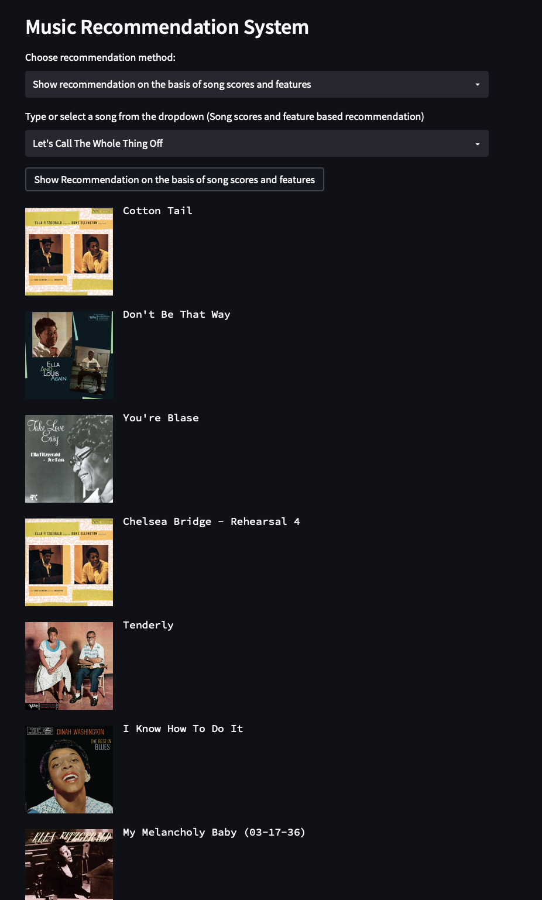
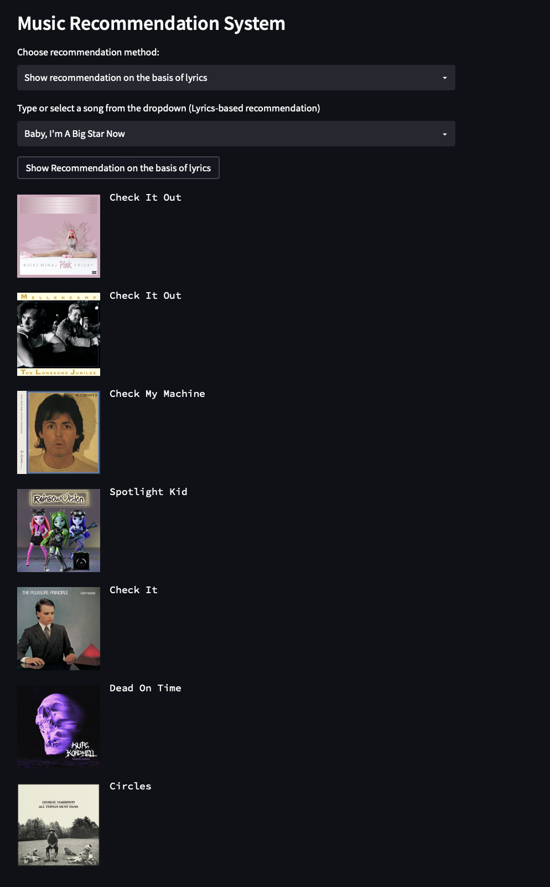
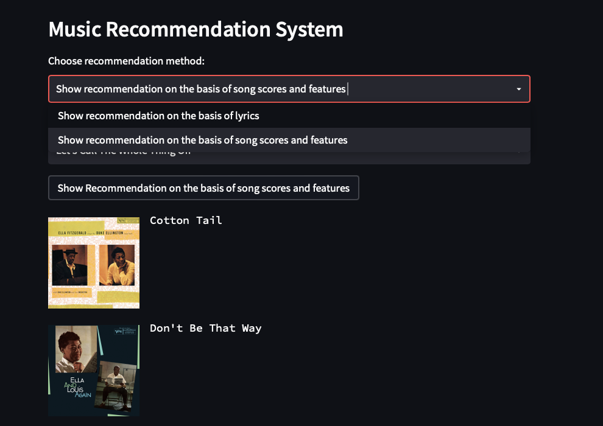

# Spotify-Song-Recommendation-System
<h3 align="left">This recommendation system has 2 features. i) Recommendation on the basis of lyrics, and ii) Recommendation on the basis of the song's features and attributes.</h3>

 

<b>This project is a song recommendation system that provides personalized song recommendations based on the content of the music itself. The system leverages content-based filtering to suggest songs in two distinct ways:

i) Lyrics-Based Recommendations: Utilizing Word2Vec, a natural language processing model, the system analyzes the lyrics of songs to understand their semantic similarity. This allows the recommendation engine to suggest songs with similar lyrical themes or styles.

ii) Song Features and Attributes-Based Recommendations: By analyzing various features and attributes of songs—such as genre, tempo, energy, and 9 others—the system identifies songs with similar characteristics to recommend to users.
  </b>

## Technology Stack

1) Streamlit: The framework used to create an interactive and user-friendly web interface for the recommendation system. 
2) Amazon EC2: The application is deployed on an Amazon EC2 instance.

## Datasets used
1) artist.csv: https://www.kaggle.com/datasets/yamaerenay/spotify-dataset-19212020-600k-tracks/data?select=artists.csv 
2) track.csv: https://www.kaggle.com/datasets/yamaerenay/spotify-dataset-19212020-600k-tracks/data?select=tracks.csv
3) spotify_millsongdata.csv: https://www.kaggle.com/datasets/notshrirang/spotify-million-song-dataset

## Libraries Used
•⁠  ⁠Scikit-learn
•⁠  ⁠NLTK (NLP)
•⁠  Streamlit

## Screenshots

&nbsp;&nbsp;

&nbsp;&nbsp;

 

